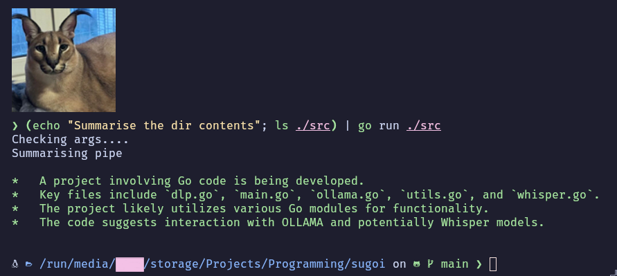

# sugoi (*su*mmarise *go*)
sugoi is a swiss army knife video summariser written in Go.

## Supported Input Types
sugoi works with YouTube links, local files (just pass the file path and it’ll read and summarise), raw string input, and content piped from other commands.

## Usage Example
```sh
# Summarise a youtube video
go run ./src "https://youtu.be/dQw4w9WgXcQ"

# Summarise a string arg
go run ./src "This statement is false"

# Summarise a piped string
echo "Summarise the dir contents"; ls ./src | go run ./src

# Summarise a file

cat ./src/main.go | go run ./src
```
Note: If you are running from an installed binary, you would replace `go run ./src` with `sugoi`

## Install Deps (Arch)
```sh
sudo pacman -S torchvision-cuda python-openai-whisper
```

## Preview


## Building And Installing
### Build the binary
```sh
go build -o sugoi ./src
```
### Move it (optional)
```sh
sudo rm "$(which sugoi)"; sudo mv ./sugoi /usr/bin
```

## Note
This was made for Arch on Nvidia, you might need a few manual tweaks